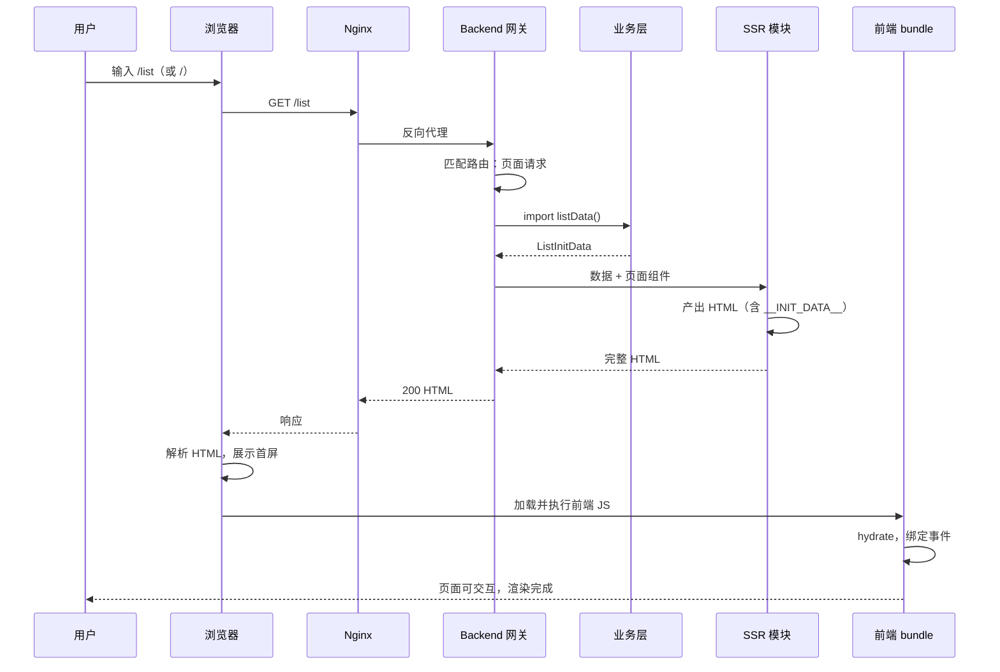
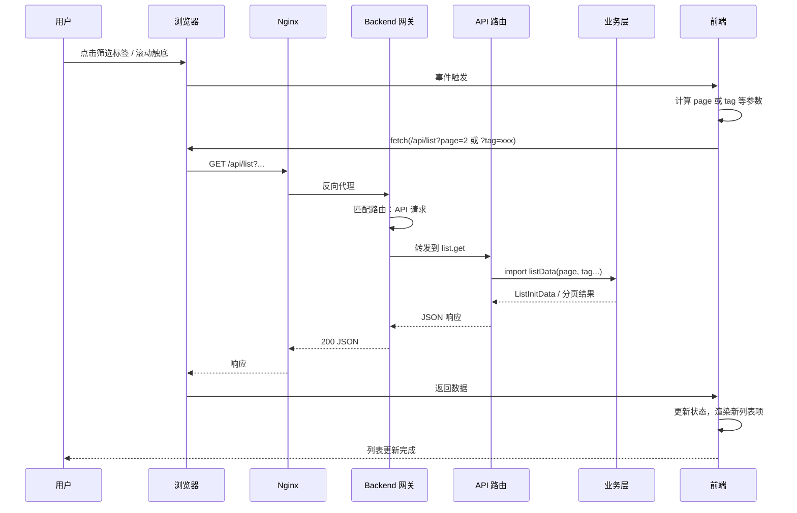

# MVP 后端方案：Node + SolidStart（前后端分离，SSR 为优化手段）

本文档给出 **MVP 阶段完整后端方案**：**目录与职责前后端分离**；Node 跑后端（网关、业务层、API），前端**参考现有 demo**（`apps/list` + `packages/` 的 monorepo）；**SSR 仅为首屏的一种优化手段**，由后端在需要时使用前端构建产物产出 HTML，不改变「前端 = UI / 后端 = 网关+业务+API」的边界。并约定目录结构、与 09/10 契约的对应关系，以及一次性删除 Go/Deno 的节奏。评审通过后再按此方案实现。

---

## 一、目标与原则

- **前后端分离**：**目录与代码**明确区分前端与后端；前端只负责 UI、路由与 client  bundle；后端负责网关、业务层、API，以及（可选）用前端产物做 SSR。
- **SSR 只是优化手段**：首屏可以「后端返回空壳 + `__INIT_DATA__`、前端 hydrate」或「后端用 SSR 直接出首屏 HTML」；无论哪种，**架构上都是后端提供数据与页面响应、前端提供 UI**，SSR 不模糊前后端边界。
- **唯一后端进程**：只跑一个 Node 进程（可基于 SolidStart/Nitro 或 Express 等），不再保留 Go、Deno。
- **方案 B**：静态资源（`/assets/*`、`public/`）由 **Node 网关** 统一提供（Nginx 只反代到 Node）。
- **契约不变**：URL 与链接规则仍按 [09-url-routing-and-links.md](./09-url-routing-and-links.md)，首屏数据与 API 形态按 [10-api-contract.md](./10-api-contract.md)；列表项 `href` 为完整 URL，由后端用 `SITE_BASE` 生成。
- **前后端边界**：**不使用 `"use server"`**；数据只通过 (1) 后端在首屏注入 `__INIT_DATA__`，或 (2) 前端 **fetch 后端 HTTP API** 获取；业务层仅在后端，不进入前端 bundle。

---

## 二、前后端边界（硬约束）

- **后端**：仅以下两种方式对**前端**暴露能力：
  - **HTTP API**：如 `GET /api/list` 返回 `{ scene: 'list', list: ListItem[] }`（JSON）；**前端**需要数据时通过 **fetch 该 API** 获取，契约清晰、可单独测试与文档化。
  - **首屏注入**：页面请求（如 `GET /list`）由网关调业务层拿数据后交给 SSR，注入 `window.__INIT_DATA__`，前端不为此发请求。
- **网关层**：同一进程内，**网关/路由**根据 path 决定「调业务层拿数据 → 交给页面 SSR」或「调业务层拿数据 → 返回 API JSON」；**不**存在「SSR 再请求内网 /api/list」。
- **业务层**：仅被服务端（网关、Nitro API 路由、路由 handler）**import** 调用，不进入客户端 bundle。
- **前端**：不直接调用业务层；只消费 (1) 首屏已注入的 `window.__INIT_DATA__`，或 (2) 运行时 `fetch('/api/...')` 的响应。不引入 `"use server"`。
- **SSR 拿数据的方式**：**不在 SSR 里发内网请求**。请求进入后由**网关层**根据 path 分流：若是页面请求（如 `GET /list`），网关/路由**直接调业务层**拿数据，把数据交给 SSR 渲染出 HTML；若是 API 请求（如 `GET /api/list`），网关/路由同样**直接调业务层**，返回 JSON。数据在网关层「调业务层一次」就拿到，再分发给页面或 API 响应，**无自请求**。前后端契约 =「`/api/list` 的响应形状」；SSR 与 API 共用同一业务层调用，不经过 HTTP。
- **不采用 `"use server"` 的原因**：该特性通过编译期/运行时把「看起来像本地函数调用」变成 RPC，前后端边界不直观、难以审计与测试；本方案要求**显式**边界（HTTP API 或仅服务端 import），便于维护与排错。

---

## 三、三层与前后端对应

| 层 | 职责 | 落点（前后端分离后） |
|----|------|-------------------------|
| **网关** | 接 HTTP；按 path 识别场景（scenecode）；路由到页面或 API；提供静态 `/assets`、`public`。 | **后端** `backend/src/gateway/`；托管 frontend 构建产物；`/`、`/list` 走页面（调业务层后交 SSR 或壳+数据），`/api/list` 走 API。 |
| **业务层** | 纯数据与领域逻辑：**首屏数据由「查存储」获得**，如 `listData()` 从存储（或 MVP 阶段在业务层内 **mock 一份**）取数；`getSiteBase()` 等。接口与形态与日后真实存储一致。 | **后端** `backend/src/business/`；仅被 gateway、api、ssr **import** 调用；不进入前端。 |
| **SSR** | 首屏 HTML 产出（含 `__INIT_DATA__`），供前端 hydrate；**仅为优化手段**。 | **后端** `backend/src/ssr/`（可选）；网关在页面请求时调业务层拿数据，再由此模块用 frontend 的 entry-server 或仅「壳+数据」产出 HTML。前端只提供可被 SSR 调用的入口，不承载业务。 |

**请求流（网关层统一拿数据，无自请求）**  
**请求 → Nitro（网关）→ 按 path 分流**：  
- **页面**（`/`、`/list`）：网关/路由 **import** `listData()` 一次 → 把数据交给该页的 SSR 渲染 → 返回 HTML。  
- **API**（`/api/list`）：网关/路由 **import** `listData()` 一次 → 返回 JSON。  
- **静态**：Nitro 直接响应。  
同一进程内数据只在网关层调业务层获取，SSR 不请求 `/api/list`。

---

## 四、目录与仓库结构（前后端分离）

- **删除**：`app/backend`（Go）、`app/server`（Deno）、`app/server-node`（若存在），一次性移除。
- **原则**：**目录层面前后端分离**；前端仅含 UI 与 client 构建产物，后端仅含网关、业务层、API；**SSR 作为后端的一种输出方式**，由后端在需要时使用前端构建结果（或仅注入数据），不把「SSR」与「前端」混为一谈。**前后端同构的通用部分**（契约类型、API 形状、scenecode 等）单独成包，与 frontend、backend **并列**，避免双份维护。

**推荐结构**：`app/contract`（前后端共用）、`app/frontend`、`app/backend` 三者并列；前端目录参考现有 demo 的 monorepo 形态。

```
app/
├── contract/                     # 前后端共用：契约类型、API 形状、scenecode、__INIT_DATA__ 等（与 frontend/backend 并列）
│   ├── src/
│   │   ├── index.ts              # 统一 re-export
│   │   ├── init-data.d.ts        # 纯类型：ListItem、ListInitData、InitData
│   │   ├── init-data.ts          # 运行时常量：INIT_DATA_ID、INIT_DATA_GLOBAL
│   │   ├── scenecode.d.ts        # 纯类型：SceneCode 等
│   │   ├── scenecode.ts          # 运行时常量（若有）
│   │   └── ...
│   ├── tsconfig.json
│   └── package.json              # 如 @aura/contract，被 frontend 与 backend 共同依赖
├── frontend/                     # 前端（参考现有 demo）：pnpm monorepo，仅 UI 与构建产物
│   ├── apps/
│   │   └── list/                 # 列表应用（当前 demo）
│   │       ├── src/
│   │       │   ├── App.tsx
│   │       │   ├── main.tsx
│   │       │   └── index.css
│   │       ├── index.html
│   │       ├── vite.config.ts
│   │       └── package.json      # @aura/app-list，依赖 @aura/contract
│   ├── packages/
│   │   ├── page-common/          # 首屏数据解析、getInitData 等（可依赖 @aura/contract）
│   │   └── request-sdk/          # 请求封装（可选）
│   ├── pnpm-workspace.yaml
│   └── package.json              # build:list、dev 等脚本
├── backend/                      # 后端：网关、业务层、API；托管 frontend 静态；SSR 为可选优化
│   ├── src/
│   │   ├── gateway/
│   │   ├── business/
│   │   │   └── list.ts           # listData() 从存储取数，MVP 在业务层内 mock；getSiteBase()；可 import @aura/contract
│   │   ├── api/
│   │   │   └── list.get.ts       # 返回 JSON 形状与 contract 一致
│   │   └── ssr/
│   └── package.json              # 依赖 @aura/contract
├── nginx/
│   └── nginx.conf
├── docker-compose.yml
├── run.py
└── README.md
```

- **contract**：与 frontend、backend **并列**的独立包；仅含契约类型、scenecode、`__INIT_DATA__` 结构等前后端同构内容；**frontend 与 backend 共同依赖**，不归属任一端，保证 API/首屏数据定义单一来源。
- **契约包规范（项目规范）**：**纯类型**（interface、type）放在 **`.d.ts`** 中，不产出运行时代码；**运行时常量**（如 `INIT_DATA_ID`、`INIT_DATA_GLOBAL`）放在 **`.ts`** 中导出，供前端/后端在运行时使用。同一主题可拆成 `xxx.d.ts`（类型）+ `xxx.ts`（常量），由 `index.ts` 统一 re-export。
- **frontend**：沿用现有 demo 结构；`apps/list` 为列表页（Vite + Solid），依赖 `@aura/contract`；`packages/page-common`、`request-sdk` 仅前端用（可依赖 contract）；不再在 frontend 内维护契约定义，改为依赖 app/contract。
- **backend**：Node 项目；依赖 `@aura/contract` 做类型与返回形状；**业务层**负责首屏数据从「存储」获取，MVP 在业务层内 mock 一份，网关/API/SSR 只调业务层；其余同上。**SSR 只是 backend 的一种响应方式**，不改变「前端 = UI、后端 = 网关+业务+API」的边界。

---

## 五、数据流与契约对齐

- **首屏数据来源**：首屏数据应由**业务层通过「查存储」获得**；MVP 阶段尚未接真实 DB 时，**在业务层内 mock 一份**（如 `listData()` 内部返回写死的 ListItem[] 或从内存/文件读），接口与返回形态与日后真实存储一致，网关/API 只调业务层、不关心数据从哪来。
- **list 场景**：`GET /`、`GET /list` 进入列表页路由；**服务端**在渲染该页时 **import** `listData()`（业务层，内部查存储或 mock）得到 `ListInitData`（`{ scene: 'list', list: ListItem[] }`），注入首屏 HTML 与 `__INIT_DATA__`；每条 `ListItem` 含 `href`（完整 URL）。与 10 的「首屏数据」及「列表项 href」一致。可选：同时提供 `GET /api/list` 返回同一 JSON，供前端异步请求或测试。
- **SITE_BASE**：环境变量，默认 `http://localhost:9080`（或开发时 3000）；业务层 `getSiteBase()` 读此变量拼链接，与 09 的「链接由系统生成、host 由配置」一致。
- **健康检查**：SolidStart/Nitro 可挂 `GET /health` 或沿用现有约定，由路由或 Nitro 插件实现。

### 流程示意：从进入列表到分页/筛选

**（A）输入 URL → 列表页首屏渲染完成**



**（B）点击筛选标签 / 滚动到下一页 → 请求分页数据 → 更新列表**



- 首屏与分页/筛选共用同一业务层 `listData()`；首屏由网关调业务层后交 SSR 注入，分页/筛选由前端 fetch `/api/list`，网关经 API 路由再调同一业务层返回 JSON。

---

## 六、部署与运行

- **本地开发**：若 contract 为独立包，需先安装/构建 contract，再构建 frontend、起 backend；或通过 workspace 统一安装依赖。静态与页面响应均由 **backend** 提供（backend 托管 frontend 的 dist）。
- **生产构建**：`contract` 为库包，由 frontend/backend 依赖引用，通常无需单独构建；`frontend` 构建出 client；`backend` 构建出 Node 服务；运行时可只起 backend，backend 托管 frontend 的静态并负责网关、API、SSR。
- **Docker**：镜像内安装 Node、复制 `app/contract`、`app/frontend`、`app/backend`，安装各包依赖（contract 被 frontend/backend 依赖），先构建 frontend 再构建 backend、启动 Node（backend）；暴露 3000（或配置端口）。**不**再构建 Go/Deno。
- **Nginx**：反向代理到 Node（backend）；静态由 backend 提供，不单独挂 volume。
- **run.py**：「安装并构建 contract（若需）→ frontend → backend → docker compose up」；不再编译 Go、不再起 Deno。

---

## 七、与现有前端的衔接

- **前端目录参考现有 demo**，保留 `app/frontend` 的 `apps/list` + `packages/page-common`、`request-sdk` 结构；**契约与前后端共用类型** 迁出为与 frontend、backend 并列的 **`app/contract`**，frontend 与 backend 共同依赖该包，避免双份维护。
- 契约类型（ListItem、ListInitData、scenecode 等）与 10 保持一致，统一放在 `app/contract`；前端只消费 `__INIT_DATA__` 或 fetch `/api/list`，不引用 backend 业务层。Backend 托管 `frontend/apps/list/dist`，构建顺序可为 contract → frontend → backend，构建命令沿用现有 `pnpm build:list` 等。

---

## 八、一次性删除清单

- **删除**：`app/backend`（Go 全部）、`app/server`（Deno 全部）、`app/server-node`（若存在）、`app/deno.json`；`app/run.py`、`app/Dockerfile`、`app/docker-compose.yml` 中所有对 Go/Deno 的引用。
- **保留并沿用**：`app/nginx`（upstream 改为 Node）；新的 `app/frontend` 与 `app/backend` 目录（前后端分离）。

---

## 九、验收要点（与 09/10 对齐）

- 访问 `http://localhost:9080/` 或 `http://localhost:9080/list` 得到列表页，首屏由 Node SSR 输出，列表数据来自业务层 `listData()`，无额外 list API 请求。
- 列表项 `href` 为完整 URL（如 `http://localhost:9080/article/article-1`），由 `SITE_BASE` 生成。
- `window.__INIT_DATA__` 存在且为 `{ scene: 'list', list: [...] }`（或与 10 约定一致的扁平结构），前端可 hydrate。
- 静态资源 `/assets/*` 由 Node 提供，Nginx 只做反代。
- 仅一个 Node 进程（跑 backend）；backend 托管 frontend 构建产物；无 Go、无 Deno 进程。

---

## 十、小结

| 项 | 约定 |
|----|------|
| **目录** | **contract**（与 frontend/backend 并列，前后端共用）+ **frontend**（demo：apps/list + packages，仅 UI）+ **backend**（Node，网关+业务+API+可选 SSR）。 |
| **运行时** | Node 单进程（跑 backend）；backend 托管 frontend 构建产物。 |
| **网关** | backend 内；路由、静态、path → scenecode，统一提供页面与 `/assets`。 |
| **业务层** | backend 内；首屏数据由「查存储」获得，MVP 在业务层内 mock；仅被后端 import。 |
| **SSR** | 仅为首屏优化手段；由 backend 在页面请求时调业务层拿数据后产出 HTML（或壳+数据），**不**模糊前后端边界。 |
| **删除** | Go（原 backend）、Deno（server）、server-node，一次性。 |
| **契约** | 继续遵循 09（URL/链接）、10（首屏数据与 href）。 |

此方案可直接作为实现规格；若希望调整目录或补充健康检查/错误页等，可在本文档上增补后再开发。
